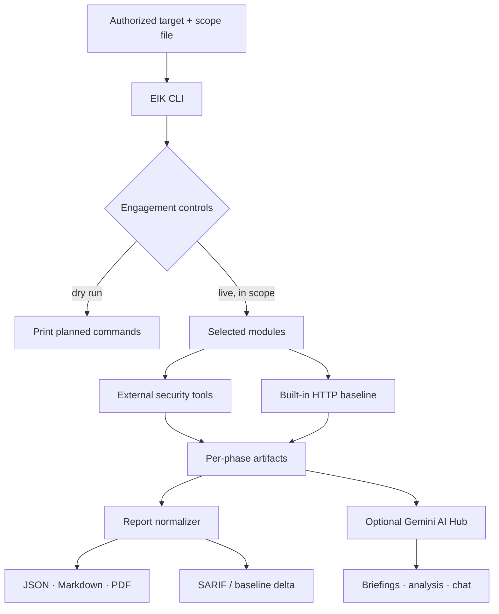

# EIK — Ethical Intelligence Toolkit

```text
  ███████╗██╗██╗  ██╗
  ██╔════╝██║██║ ██╔╝     Ethical Intelligence Toolkit
  █████╗  ██║█████╔╝      AI-assisted security-assessment orchestration
  ██╔══╝  ██║██╔═██╗
  ███████╗██║██║  ██╗
  ╚══════╝╚═╝╚═╝  ╚═╝
```

> Recon. Analyze. Validate. Report. Defend.

[](https://github.com/ayushyadav130710/EIK) [](https://www.python.org/) [](https://www.kali.org/) [](#authorization--scope)

**EIK** is an AI-powered, command-line security-assessment toolkit by [Ayush Yadav](https://github.com/ayushyadav130710). It orchestrates installed security tools, saves their artifacts, normalizes selected results into findings, and can use Google Gemini to summarize an authorized assessment.

**[Repository](https://github.com/ayushyadav130710/EIK)** · **[ HACK RESPONSIBLY | DEFEND FEARLESSLY ]**

## 🧠 What is EIK?

EIK brings reconnaissance, network and web assessment, service enumeration, reporting, and optional AI-assisted review into one CLI workflow. It is an **orchestrator**, not a replacement for the tools it invokes: run coverage depends on the binaries installed on the host.

It is designed for systems you own or are explicitly authorized in writing to assess: labs, CTFs, internal assessments, defensive research, and defined penetration-testing engagements. A finding is evidence to investigate—not proof of exploitability—and automated output requires human validation.

## Capabilities

| Area | Actual capability |
| --- | --- |
| Reconnaissance | WHOIS, DNS, subdomain/OSINT and live-host discovery when tools are installed; search-dork queries are saved for manual review. |
| Network & services | Masscan (when privileged), Nmap service/script scans, optional Nmap `vuln` scripts, SSLScan, parsed open ports. |
| Web assessment | WhatWeb, Nikto, Nuclei, Gobuster or FFUF, conditional WPScan, plus a built-in HTTP header/cookie hardening baseline. |
| Service enumeration | SMB/WinRM enumeration only when discovered ports indicate it; Searchsploit queries for observed non-web services. |
| Active workflows | SQLMap, Hydra, Metasploit handler setup, payload generation, and post-exploitation helper artifacts behind an active-testing gate. |
| Reporting & CI | JSON, Markdown, optional PDF/SARIF, stable fingerprints, baseline deltas, and a severity exit gate. |
| AI Hub | Optional Google Gemini phase briefings, analysis, report summary, Q&A, and chat using local artifacts. |
| Engagement controls | Authorization confirmation, engagement label, scope validation, dry run, and run manifest. |

## Architecture



`EIK.py` parses the engagement and runs modules. `Runner` executes available binaries and saves command/stdout/stderr artifacts. Module 7 extracts supported artifacts into deduplicated findings; it does not normalize every raw tool output. `eik_ai.py` harvests local artifacts and, only when configured, submits context to Gemini.

## Modules

| Module | Name | Purpose | Main tools / integrations |
| ---: | --- | --- | --- |
| 1 | Reconnaissance | Domain registration, DNS, subdomain and OSINT collection | whois, dig, subfinder, dnsrecon, theHarvester, httpx |
| 2 | Port Scan | Port discovery, service detection, TLS review | masscan, nmap, sslscan |
| 3 | Web Scan | Technology discovery, web checks, content discovery, HTTP baseline | whatweb, nikto, nuclei, gobuster/ffuf, wpscan |
| 4 | Service Enumeration | Conditional SMB/WinRM enumeration and exploit-db lookups | enum4linux-ng/enum4linux, smbmap, netexec/crackmapexec, searchsploit |
| 5 | Exploitation | Explicitly gated workflow helpers and vector catalog | sqlmap, hydra, msfconsole, `exploit_extensions_v2.py` |
| 6 | Post-Exploit | Explicitly gated payload and listener/persistence helper artifacts | msfvenom, ncat notes |
| 7 | Report | Normalize artifacts and render reports | reportlab (optional PDF) |
| 8 | AI Hub | Context-aware assessment summaries and interaction | Google Gemini API |

Missing binaries are reported and skipped, so EIK continues with the capabilities available on the machine.

## Advanced vulnerability taxonomy

Module 5 invokes `exploit_extensions_v2.py` for a catalog of **100+ named vectors across 10 categories**. Each category writes JSON entries with a payload/example, detection pattern, severity, impact, and `requires_manual_testing: true`; it is **assisted/informational**, not a live exploit verifier. The entries are not automatically converted into Module 7 confirmed findings.

| Category | Coverage | Workflow |
| --- | --- | --- |
| Injection & input handling | SQL/NoSQL/LDAP/XPath, command, template, XXE, GraphQL, CRLF and related inputs | Catalog-assisted |
| Authentication & session | Credential, session, token, OAuth/MFA and default-credential scenarios | Catalog-assisted |
| Access control & privilege | IDOR, privilege, traversal, upload, API and CORS scenarios | Catalog-assisted |
| Server-side & environment | SSRF, inclusion, deserialization, RCE, smuggling and WebSocket scenarios | Catalog-assisted |
| Client-side | XSS, CSRF, clickjacking, redirect, DOM and cookie scenarios | Catalog-assisted |
| Misconfiguration & infrastructure | Headers, TLS, debug/default settings, storage and exposure scenarios | Catalog-assisted; HTTP baseline is automated separately |
| Business logic & API | Workflow, race, pricing, rate-limit, key and parameter scenarios | Catalog-assisted |
| Cryptographic & data exposure | Algorithms, keys, entropy, TLS, hashing and data exposure scenarios | Catalog-assisted |
| DoS & resource exhaustion | ReDoS, XML/entity, slow-request and resource-limit scenarios | Catalog-assisted |
| Memory & structural | Buffer/integer/format-string and lifetime-management scenarios | Catalog-assisted |

“Vector supported” means EIK records a test idea and metadata. It does **not** mean a vulnerability exists or is exploitable.

## 🤖 AI Hub (Gemini)

The optional AI Hub in `eik_ai.py` uses `google-generativeai` when available and falls back to Gemini's REST API. Its default model is `gemini-2.0-flash`; override it with `--ai-model`.

```bash
# Linux / Kali
export GEMINI_API_KEY="your-api-key"
```

```powershell
# Windows PowerShell
$env:GEMINI_API_KEY = "your-api-key"
```

`--ai-key` supplies a one-invocation key; `EIK_GEMINI_KEY` is also recognized. Without a key—or with `--no-ai`—EIK runs in tool-only mode. Never commit a key or report data.

When enabled, EIK collects saved JSON command artifacts, selected Nmap/Nuclei/WhatWeb data, selected text artifacts, and report findings. It can brief after modules 1–7, write `report/ai_analysis.md` and append a report summary with module 8, answer `--ask`, or start `--chat` after a run. AI output can be wrong; treat it as analyst assistance and review it before acting.

## ⚡ Installation

Kali/Linux is the practical primary environment because most integrated security binaries are Linux-oriented. Python 3 is required.

```bash
git clone https://github.com/ayushyadav130710/EIK.git
cd EIK
python3 -m venv .venv
source .venv/bin/activate
python -m pip install --upgrade pip
pip install -r requirements.txt
python EIK.py --help
```

Install only tools needed for your authorized workflow. EIK recognizes `whois dnsutils subfinder dnsrecon theharvester httpx masscan nmap sslscan whatweb nikto nuclei gobuster ffuf wpscan enum4linux-ng smbmap netexec exploitdb sqlmap hydra metasploit-framework ncat`. Its diagnostic output suggests an `apt install` command for unavailable registered tools; some require separate setup, wordlists, privileges, or updates.

### 🪟 Windows

EIK's Python code and HTTP hardening baseline run on Windows, but the external scanner integrations are designed for Kali/Ubuntu. Use WSL2 or a Linux host for broad functionality. See [SETUP_WINDOWS.md](SETUP_WINDOWS.md). Missing Windows binaries are skipped and reported; that is not equivalent to a full Kali installation.

<a id="authorization--scope"></a>

## 🛡️ Authorization & scope

Live runs require all three controls:

| Flag | Meaning |
| --- | --- |
| `--authorized` | Your confirmation that you have written authorization. |
| `--engagement-id LABEL` | A self-chosen label recorded with the run—not proof of authorization. |
| `--scope FILE` | One allowed domain, URL, IP address, or CIDR per line; the target host must match. |

```text
# scope.txt — authorized targets
example.com
api.example.com
192.0.2.10
192.0.2.0/24
```

Exact domains cover the apex and subdomains; `.example.com` covers subdomains but not the apex. URLs are reduced to hostnames. Empty lines and `#` comments are ignored. Each run writes `output/<target>/run_manifest.json` with version, UTC time, target, authorization flag, engagement ID, scope path/entries, modules, active acknowledgement, and dry-run state.

### ⚠️ Active testing

`--dry-run` writes a manifest and prints commands without executing them; it does not require the live-run contract. Modules 1–4, 7, and 8 are not in EIK's active-module gate, though they can still send requests or invoke scanners. Modules **5 and 6** require `--allow-active` because they can recover credentials, start a handler, generate payloads, or produce post-exploitation material.

```bash
# Preview only: no commands execute
python EIK.py -t https://example.com -m 1,3,7 --dry-run --no-ai

# Authorized local-lab assessment
python EIK.py -t http://127.0.0.1:8080 --assessment-profile standard \
  --authorized --engagement-id lab-web-001 --scope scope.txt --no-ai
```

## 🎛️ CLI reference

| Flag | Purpose | Example |
| --- | --- | --- |
| `-t`, `--target` | URL, hostname, IP, or host:port; omit for wizard | `-t https://example.com` |
| `-m`, `--modules` | `all`, comma-separated IDs, or numeric ranges | `-m 1,3,7` |
| `--assessment-profile` | `passive` = 1,7,8; `standard` = 1,2,3,4,7,8; `active` = all | `--assessment-profile standard` |
| `--outdir` | Parent artifact directory | `--outdir results` |
| `--authorized`, `--engagement-id`, `--scope` | Live-run authorization contract | `--authorized --engagement-id lab-1 --scope scope.txt` |
| `--allow-active` | Acknowledge modules 5/6 | `--allow-active` |
| `--dry-run` | Print commands rather than execute them | `--dry-run` |
| `--parallel` / `--vuln` | Parallel web checks / slower Nmap vuln pass | `--parallel --vuln` |
| `--fast` / `--stealth` | Masscan/Nmap rate and timing profile | `--stealth` |
| `--no-auto-attack` | Disable automatic Hydra attempts on detected services | `--no-auto-attack` |
| `--threads`, `--hydra-service` | Configure Hydra | `--threads 8 --hydra-service ssh` |
| `--lhost`, `--lport` | Set payload/listener values | `--lhost 127.0.0.1 --lport 4444` |
| `--baseline FILE` / `--sarif` | Compare findings / write `report/eik.sarif` | `--baseline prior.json --sarif` |
| `--fail-on` | Exit 3 if report meets threshold | `--fail-on high` |
| `--no-ai`, `--ai-key`, `--ai-model` | Disable/configure Gemini | `--no-ai` |
| `--ask QUESTION` / `--chat` | One-shot AI question / chat after run | `--ask "Summarize findings"` |
| `-v`, `--verbose` | Debug logging | `--verbose` |
| `--about`, `--version`, `--help` | Tool information | `--version` |

## Quick start

```bash
# Create an authorized local-lab scope
printf '127.0.0.1\n' > scope.txt
python EIK.py --version

# Preview without network activity
python EIK.py -t http://127.0.0.1:8080 -m 1,3,7 --dry-run --no-ai

# Run only against an available, authorized local lab
python EIK.py -t http://127.0.0.1:8080 --assessment-profile standard \
  --authorized --engagement-id local-lab-001 --scope scope.txt --no-ai
```

## 📊 Reporting

Module 7 reads Nmap XML, HTTP-baseline JSON, Nikto JSON, Nuclei JSONL, WhatWeb JSON, WPScan JSON, Gobuster/FFUF output, Hydra output, and an optional root-level manual `findings.json`. It fingerprints/deduplicates supported results and writes:

```text
output/<target>/
├── run_manifest.json
├── recon/  scan/  web/  enum/  exploit/  post/
└── report/
    ├── findings.json         # normalized finding list
    ├── summary.json          # counts, fingerprints, baseline delta
    ├── report.md
    ├── report.pdf            # when reportlab is available
    ├── eik.sarif             # with --sarif
    ├── ai_briefings.json     # when generated
    └── ai_analysis.md        # when module 8 completes
```

Findings contain severity, CVSS where supplied, description, evidence, and remediation. `--baseline` adds `new` and `resolved` fingerprints to `summary.json`; `--fail-on` evaluates that summary after the run.

## 🧪 Testing

The repository uses Python's built-in `unittest`. Included tests cover scope matching, live-run controls, manifests, active gating, SARIF, deduplication, and HTTP-baseline ingestion.

```bash
python -m unittest discover -s tests -v
```

`pytest` is listed as an optional development dependency, but the included test command is `unittest`.

## 🔧 Troubleshooting

| Symptom | Resolution |
| --- | --- |
| `live runs require ...` | Supply `--authorized`, `--engagement-id`, and `--scope`; use `--dry-run` only to preview. |
| Target not covered | Correct the hostname/IP/CIDR entry in the scope file. |
| Tool skipped | Install its external binary and ensure it is on `PATH`. |
| Masscan falls back | It needs root on POSIX; EIK falls back to Nmap's configured ports. |
| Web scan skipped | Module 3 requires an `http` or `https` URL target. |
| No PDF | Install `reportlab`; Module 7 logs if it is unavailable. |
| AI disabled/failing | Set `GEMINI_API_KEY` or `--ai-key`, check API access, or use `--no-ai`. |
| Windows lacks scans | Use Kali/Ubuntu through WSL2 or a Linux host. |
| Incomplete report | Include module 7 and inspect artifacts; unsupported/missing output is not synthesized. |

## 📁 Project structure

```text
EIK/
├── EIK.py                       # CLI, modules, controls, reporting
├── eik_ai.py                    # Gemini-backed AI Hub
├── exploit_extensions_v2.py     # 10-category vector catalog
├── exploit_extensions.py        # fallback vector catalog
├── advanced_features.py          # standalone dashboard/trend/remediation helpers
├── ascii_art.py
├── requirements.txt
├── SETUP_WINDOWS.md
└── tests/test_engagement_controls.py
```

## 🔐 Security & privacy

- Test only explicitly authorized, in-scope targets.
- Never commit API keys, credentials, scope data, or scan artifacts; `.gitignore` excludes `.env` and `output/`.
- Treat reports, raw output, AI context, and recovered credentials as sensitive.
- Review automated and AI-assisted findings manually.
- Use active modules only when their impact is agreed and documented.

## 🤝 Contributing

1. Fork and clone the repository.
2. Create a focused branch.
3. Make the smallest coherent change and add/update applicable tests.
4. Run `python -m unittest discover -s tests -v`.
5. Review the diff; exclude generated output, credentials, and secrets.
6. Submit a pull request.

Contributions must preserve EIK's authorization, scope, and active-testing controls.

## 🗺️ Roadmap

Current capabilities are the modules, engagement controls, artifact collection, normalized reports/SARIF/baseline deltas, and optional Gemini analysis documented above. Potential future improvements include formal plugins, broader normalization, stronger evidence correlation, improved AI triage, CI examples, cross-platform support, and wider testing. These are aspirations, not current features.

## 📜 License

No license file is currently present in this repository. Do not assume permission to reuse or redistribute the project beyond rights granted by its owner.

## 👤 Author

**Ayush Yadav** — Founder / Developer of EIK<br>
[GitHub](https://github.com/ayushyadav130710) · [Project](https://github.com/ayushyadav130710/EIK)

---

```text
EIK — Ethical Intelligence Toolkit
Recon. Analyze. Validate. Report. Defend.
[ HACK RESPONSIBLY | DEFEND FEARLESSLY ]
Founded by Ayush Yadav
```
